# Diseño Técnico — Integración Bolívar UI Design System

## Resumen

Este documento describe la arquitectura y enfoque técnico para migrar el frontend de Conecta 2.0 desde componentes HTML nativos con Tailwind CSS (esquema indigo) hacia los Web Components del Design System de Seguros Bolívar (`sb-ui-*`), cargados vía CDN. La migración es exclusivamente visual: toda la lógica funcional (React Hook Form, React Query, Auth Context, Router, Sonner) permanece intacta.

---

## Arquitectura

### Decisión Arquitectónica Principal: Capa de Wrappers React

**Problema:** Los Web Components de Bolívar UI (`sb-ui-button`, `sb-ui-input`, etc.) son Custom Elements del DOM. React 18 tiene limitaciones conocidas para interactuar con Custom Elements:
- Los eventos nativos (`CustomEvent`) no se propagan al sistema de eventos sintéticos de React.
- `ref` forwarding a Custom Elements requiere manejo explícito.
- React Hook Form necesita `onChange`/`onBlur`/`value` controlados, que los Web Components exponen como eventos nativos y propiedades DOM, no como props React.

**Decisión:** Crear una capa de **wrappers React** en `src/components/ui/` que encapsulen cada Web Component de Bolívar UI. Cada wrapper:
1. Renderiza el Custom Element correspondiente (`<sb-ui-button>`, `<sb-ui-input>`, etc.).
2. Traduce props React a atributos/propiedades del Custom Element.
3. Escucha eventos nativos del Custom Element y los re-emite como callbacks React.
4. Expone `ref` compatible con React Hook Form vía `forwardRef` + `useImperativeHandle`.

**Justificación:** Esta capa intermedia permite que las páginas consuman componentes con la misma ergonomía React actual (`<SbButton onClick={...}>`, `<SbInput {...register('email')}>`) sin acoplar la lógica de negocio a la API de Custom Elements.

### Diagrama de Arquitectura

```mermaid
graph TB
    subgraph "index.html"
        CDN["CDN Bolívar UI<br/>(link + script)"]
        BRAND["data-brand='seguros-bolivar'<br/>en &lt;html&gt;"]
    end

    subgraph "packages/frontend/src"
        subgraph "Capa de Wrappers React"
            SbButton["SbButton.tsx"]
            SbInput["SbInput.tsx"]
            SbSelect["SbSelect.tsx"]
            SbTable["SbTable.tsx"]
            SbTabs["SbTabs.tsx"]
            SbModal["SbModal.tsx"]
            SbAlert["SbAlert.tsx"]
            SbSpinner["SbSpinner.tsx"]
        end

        subgraph "Páginas (sin cambios en lógica)"
            Login["Login.tsx"]
            Register["Register.tsx"]
            Catalog["Catalog.tsx"]
            Sandbox["Sandbox.tsx"]
            Analytics["Analytics.tsx"]
            Notifications["Notifications.tsx"]
            ConsumerMgmt["ConsumerManagement.tsx"]
            ApiMgmt["ApiManagement.tsx"]
            ApiDetail["ApiDetail.tsx"]
        end

        subgraph "Layouts"
            AppLayout["AppLayout.tsx"]
            AuthLayout["AuthLayout.tsx"]
        end

        subgraph "Lógica (SIN cambios)"
            AuthCtx["AuthContext.tsx"]
            ApiLib["api.ts (Axios)"]
            RQ["React Query"]
            RHF["React Hook Form + Zod"]
            Router["React Router"]
        end
    end

    CDN --> SbButton
    CDN --> SbInput
    CDN --> SbSelect
    CDN --> SbTable
    CDN --> SbTabs
    CDN --> SbModal
    CDN --> SbAlert
    CDN --> SbSpinner

    Login --> SbButton
    Login --> SbInput
    Register --> SbButton
    Register --> SbInput
    Register --> SbSelect
    Catalog --> SbButton
    Catalog --> SbInput
    Catalog --> SbSelect
    Analytics --> SbTable
    Analytics --> SbSelect
    Analytics --> SbInput
    Notifications --> SbTabs
    Notifications --> SbAlert
    ConsumerMgmt --> SbTable
    ConsumerMgmt --> SbModal
    ConsumerMgmt --> SbButton
    ApiMgmt --> SbModal
    ApiMgmt --> SbButton
    ApiDetail --> SbTabs
    Sandbox --> SbButton
    Sandbox --> SbInput
    Sandbox --> SbSelect

    Login --> RHF
    Login --> AuthCtx
    Register --> RHF
    Register --> AuthCtx
    Catalog --> RQ
    Analytics --> RQ
    Notifications --> RQ
    ConsumerMgmt --> RQ
    ApiMgmt --> RQ
    ApiDetail --> RQ
    Sandbox --> Router
```



### Estrategia de Migración: Página por Página

La migración se ejecuta página por página, no componente por componente. Esto permite:
- Verificar cada página de forma aislada antes de avanzar.
- Mantener el build funcional en todo momento.
- Detectar regresiones temprano con los tests existentes.

**Orden de migración:**
1. **Infraestructura base:** CDN en `index.html`, tipos TypeScript, CSS global, wrappers React.
2. **Layouts:** AppLayout y AuthLayout (tema corporativo).
3. **Páginas de auth:** Login, Register (formularios con React Hook Form).
4. **Páginas de consulta:** Catalog, ApiDetail, Notifications.
5. **Páginas complejas:** Sandbox, Analytics.
6. **Páginas admin:** ConsumerManagement, ApiManagement (modales, tablas).
7. **Verificación final:** Tests, build, revisión visual.

---

## Componentes e Interfaces

### 1. Carga CDN (`index.html`)

Se agregan las etiquetas CDN de Bolívar UI en `<head>` y se activa la marca corporativa:

```html
<html lang="es" data-brand="seguros-bolivar">
  <head>
    <!-- Estilos Bolívar UI -->
    <link rel="stylesheet" href="https://cdn.segurosbolivar.com/ui/seguros-bolivar/styles.css" />
    <!-- Script Bolívar UI (Web Components) -->
    <script type="module" src="https://cdn.segurosbolivar.com/ui/seguros-bolivar/components.js"></script>
  </head>
```

> **Nota:** Las URLs CDN exactas se confirmarán con el equipo de Design System. Las URLs mostradas son placeholders representativos.

### 2. Declaración de Tipos TypeScript (`src/types/bolivar-ui.d.ts`)

```typescript
declare namespace JSX {
  interface IntrinsicElements {
    'sb-ui-button': React.DetailedHTMLProps<React.HTMLAttributes<HTMLElement>, HTMLElement> & {
      variant?: 'primary' | 'secondary' | 'tertiary' | 'error';
      'style-type'?: 'fill' | 'stroke' | 'text';
      size?: 'small' | 'medium' | 'large';
      disabled?: boolean;
      loading?: boolean;
      type?: 'button' | 'submit' | 'reset';
    };
    'sb-ui-input': React.DetailedHTMLProps<React.HTMLAttributes<HTMLElement>, HTMLElement> & {
      type?: string;
      value?: string;
      placeholder?: string;
      disabled?: boolean;
      error?: boolean;
      'error-message'?: string;
      label?: string;
      name?: string;
    };
    'sb-ui-select': React.DetailedHTMLProps<React.HTMLAttributes<HTMLElement>, HTMLElement> & {
      value?: string;
      placeholder?: string;
      disabled?: boolean;
      error?: boolean;
      label?: string;
      name?: string;
    };
    'sb-ui-table': React.DetailedHTMLProps<React.HTMLAttributes<HTMLElement>, HTMLElement>;
    'sb-ui-tabs': React.DetailedHTMLProps<React.HTMLAttributes<HTMLElement>, HTMLElement> & {
      'active-tab'?: string | number;
    };
    'sb-ui-modal': React.DetailedHTMLProps<React.HTMLAttributes<HTMLElement>, HTMLElement> & {
      open?: boolean;
      title?: string;
    };
    'sb-ui-alert': React.DetailedHTMLProps<React.HTMLAttributes<HTMLElement>, HTMLElement> & {
      variant?: 'info' | 'success' | 'warning' | 'error';
      closable?: boolean;
    };
    'sb-ui-spinner': React.DetailedHTMLProps<React.HTMLAttributes<HTMLElement>, HTMLElement> & {
      size?: 'small' | 'medium' | 'large';
    };
    'sb-ui-breadcrumb': React.DetailedHTMLProps<React.HTMLAttributes<HTMLElement>, HTMLElement>;
  }
}
```

### 3. Wrappers React (`src/components/ui/`)

Cada wrapper sigue el mismo patrón. Ejemplo representativo para `SbInput`:

```typescript
// src/components/ui/SbInput.tsx
import { forwardRef, useRef, useEffect, useImperativeHandle, useCallback } from 'react';

interface SbInputProps {
  type?: string;
  value?: string;
  placeholder?: string;
  disabled?: boolean;
  error?: boolean;
  errorMessage?: string;
  label?: string;
  name?: string;
  id?: string;
  autoComplete?: string;
  onChange?: (value: string) => void;
  onBlur?: () => void;
}

export const SbInput = forwardRef<HTMLElement, SbInputProps>(
  ({ onChange, onBlur, error, errorMessage, ...props }, ref) => {
    const innerRef = useRef<HTMLElement>(null);

    useImperativeHandle(ref, () => {
      const el = innerRef.current!;
      return Object.assign(el, {
        get value() { return (el as any).value ?? ''; },
        set value(v: string) { (el as any).value = v; },
        focus() { el.focus(); },
      });
    });

    const handleChange = useCallback((e: Event) => {
      const val = (e as CustomEvent).detail?.value ?? (e.target as any)?.value ?? '';
      onChange?.(val);
    }, [onChange]);

    const handleBlur = useCallback(() => { onBlur?.(); }, [onBlur]);

    useEffect(() => {
      const el = innerRef.current;
      if (!el) return;
      el.addEventListener('sb-change', handleChange);
      el.addEventListener('change', handleChange);
      el.addEventListener('blur', handleBlur);
      return () => {
        el.removeEventListener('sb-change', handleChange);
        el.removeEventListener('change', handleChange);
        el.removeEventListener('blur', handleBlur);
      };
    }, [handleChange, handleBlur]);

    return (
      <sb-ui-input
        ref={innerRef}
        error={error || undefined}
        error-message={errorMessage}
        {...props}
      />
    );
  }
);
SbInput.displayName = 'SbInput';
```

**Wrappers a crear:**

| Wrapper | Web Component | Uso principal |
|---------|--------------|---------------|
| `SbButton` | `<sb-ui-button>` | Botones primarios/secundarios en todas las páginas |
| `SbInput` | `<sb-ui-input>` | Campos de texto, email, password, date |
| `SbSelect` | `<sb-ui-select>` | Selects en formularios y filtros |
| `SbTextarea` | `<sb-ui-input>` (variante textarea) | Campos multilínea (body JSON, motivo, spec) |
| `SbTable` | `<sb-ui-table>` | Tablas en Analytics y ConsumerManagement |
| `SbTabs` | `<sb-ui-tabs>` | Pestañas en ApiDetail y Notifications |
| `SbModal` | `<sb-ui-modal>` | Modales en ConsumerManagement y ApiManagement |
| `SbAlert` | `<sb-ui-alert>` | Alertas de deprecación, urgencia, errores |
| `SbSpinner` | `<sb-ui-spinner>` | Indicadores de carga |
| `SbBreadcrumb` | `<sb-ui-breadcrumb>` | Navegación jerárquica en ApiDetail |

### 4. Integración con React Hook Form

La integración con React Hook Form se logra mediante el patrón `Controller` de RHF, que permite controlar componentes no nativos:

```typescript
// Ejemplo en Login.tsx
import { Controller, useForm } from 'react-hook-form';
import { SbInput } from '../components/ui/SbInput';

// Dentro del formulario:
<Controller
  name="email"
  control={control}
  render={({ field, fieldState }) => (
    <SbInput
      type="email"
      label="Correo electrónico"
      placeholder="tu@empresa.com"
      value={field.value}
      onChange={field.onChange}
      onBlur={field.onBlur}
      error={!!fieldState.error}
      errorMessage={fieldState.error?.message}
      autoComplete="email"
    />
  )}
/>
```

**Decisión:** Usar `Controller` en lugar de `register()` directo. Los Web Components no exponen la interfaz `HTMLInputElement` estándar que `register()` espera. `Controller` da control total sobre cómo se leen/escriben valores.

### 5. CSS Global y Tema Corporativo (`src/index.css`)

```css
@import "tailwindcss";

/* Estilos de transición para complementar Bolívar UI */
@layer base {
  [data-brand="seguros-bolivar"] {
    --sb-ui-color-primary-base: #009056;
    --sb-ui-color-primary-D100: #038450;
    --sb-ui-color-primary-L400: #F2F9F6;
  }
}
```

Tailwind CSS se mantiene para layout y utilidades que Bolívar UI no cubre (grid, flex, spacing de layout). Los componentes interactivos migran a Web Components.

### 6. Mapeo de Migración por Página

| Página | Elementos a migrar | Wrapper(s) |
|--------|-------------------|------------|
| **Login** | 2 inputs, 1 button submit, labels | SbInput, SbButton |
| **Register** | 5 inputs, 1 select, 1 button submit, labels | SbInput, SbSelect, SbButton |
| **Catalog** | 1 input búsqueda, 2 selects filtro, cards (botones), badge deprecación | SbInput, SbSelect, SbAlert |
| **ApiDetail** | 3 tabs, botón volver, badges, breadcrumb | SbTabs, SbButton, SbBreadcrumb |
| **Sandbox** | 2 selects, 1 input path, inputs headers, 1 textarea body, 1 button ejecutar | SbSelect, SbInput, SbTextarea, SbButton, SbSpinner |
| **Analytics** | 2 inputs date, 1 select API, tabla peticiones, barra cuota | SbInput, SbSelect, SbTable |
| **Notifications** | 2 tabs, alertas por prioridad, badges | SbTabs, SbAlert |
| **ConsumerManagement** | 1 input búsqueda, tabla, 3 botones acción, modal confirmación | SbInput, SbTable, SbButton, SbModal |
| **ApiManagement** | Botón nueva API, 3 modales (nueva API, publicar versión, plan sunset), inputs/textarea | SbButton, SbModal, SbInput, SbTextarea |
| **AppLayout** | Sidebar (colores), header (colores), logo | Tokens CSS corporativos |
| **AuthLayout** | Logo, colores fondo | Tokens CSS corporativos |

---

## Modelos de Datos

### Sin cambios en modelos de datos

Esta migración es exclusivamente visual. **Ninguna interfaz TypeScript, estructura de datos mock, ni configuración de React Query cambia.**

Interfaces preservadas sin modificación:
- `ApiItem`, `Consumer`, `MetricCard`, `RequestRow` (Analytics)
- `Notification` (Notifications)
- `ManagedApi`, `ApiVersion` (ApiManagement)
- `Header`, `HistoryEntry`, `MockResponse` (Sandbox)
- `User`, `AuthState`, `RegisterData` (AuthContext)
- `LoginForm`, `RegisterForm` (esquemas Zod)

### Nuevas interfaces (solo para wrappers)

```typescript
// Props compartidas para wrappers
interface SbBaseProps {
  className?: string;
  id?: string;
  'data-testid'?: string;
}

// Props específicas de cada wrapper (ver sección Componentes)
```

Estas interfaces son internas a la capa de wrappers y no afectan los contratos de datos existentes.


---

## Propiedades de Correctitud

*Una propiedad es una característica o comportamiento que debe mantenerse verdadero en todas las ejecuciones válidas de un sistema — esencialmente, una declaración formal sobre lo que el sistema debe hacer. Las propiedades sirven como puente entre especificaciones legibles por humanos y garantías de correctitud verificables por máquina.*

### Evaluación de Aplicabilidad de PBT

Esta feature es principalmente una **migración visual** (UI rendering, cambio de componentes HTML a Web Components). La mayoría de los criterios de aceptación son:
- Verificaciones de configuración (SMOKE): CDN cargado, data-brand presente, tipos TS compilando.
- Mapeos estáticos (EXAMPLE): cada página renderiza el Web Component correcto.
- Preservación de flujos (INTEGRATION): los 27 criterios del Req 14 son regresiones.
- Convenciones de código (no testable): reglas CSS del Req 12.

Sin embargo, la **capa de wrappers React** introduce lógica propia que sí es testable con PBT:
- Los wrappers traducen props React → atributos de Custom Elements.
- Los wrappers traducen eventos nativos → callbacks React.
- Los wrappers integran con React Hook Form vía Controller.

Estas traducciones son funciones puras con input/output claro y un espacio de entrada amplio (cualquier combinación de props, cualquier valor de formulario, cualquier índice de tab). PBT es apropiado para esta capa.

### Property 1: Forwarding de props booleanas en wrappers interactivos

*Para cualquier* combinación de props booleanas (`disabled`, `loading`) pasadas a un wrapper React (`SbButton`), el Custom Element subyacente (`<sb-ui-button>`) SHALL tener los atributos HTML correspondientes correctamente establecidos, y cuando `disabled` es `true`, los clicks no SHALL invocar el callback `onClick`.

**Validates: Requirements 3.3, 3.4, 9.2**

### Property 2: Puente de valores de formulario entre React Hook Form y Web Components

*Para cualquier* valor de string generado aleatoriamente y despachado como evento de cambio desde un wrapper de input (`SbInput`, `SbSelect`), el estado de React Hook Form SHALL contener exactamente el mismo valor. Además, *para cualquier* estado de error (`true`/`false`) y mensaje de error, el wrapper SHALL establecer los atributos `error` y `error-message` en el Custom Element subyacente de forma consistente.

**Validates: Requirements 4.4, 4.5, 11.1**

### Property 3: Selección de tab muestra el panel correcto

*Para cualquier* conjunto de N tabs (N ≥ 1) y cualquier índice seleccionado `i` (0 ≤ i < N), el wrapper `SbTabs` SHALL mostrar únicamente el contenido del panel `i`-ésimo y ocultar todos los demás paneles.

**Validates: Requirements 6.3**

---

## Manejo de Errores

### 1. CDN no disponible (Req 1.4)

**Estrategia:** Degradación graceful. Si el script CDN no carga:
- Los Custom Elements no se registran → el navegador los trata como `HTMLUnknownElement`.
- El contenido dentro de los tags (`<sb-ui-button>Texto</sb-ui-button>`) se renderiza como texto plano.
- La aplicación no se bloquea porque React no depende de que los Custom Elements estén definidos.

**Implementación:** Agregar `onerror` handler en el script tag CDN que establezca una variable global `window.__SB_UI_LOADED__ = false`. Los wrappers pueden verificar esta variable para aplicar estilos fallback con Tailwind.

### 2. Eventos no propagados desde Web Components

**Estrategia:** Los wrappers escuchan tanto el evento custom (`sb-change`) como el evento estándar (`change`) para máxima compatibilidad. Si ninguno se dispara, el wrapper no actualiza el estado — el formulario mantiene su valor anterior (fail-safe).

### 3. Incompatibilidad de tipos en Custom Elements

**Estrategia:** El archivo `bolivar-ui.d.ts` declara los tipos esperados. Si la CDN entrega una versión con API diferente, TypeScript no detectará el error en runtime. Los wrappers usan optional chaining (`(e as CustomEvent).detail?.value`) para evitar crashes por propiedades faltantes.

### 4. Tests fallando por Custom Elements en jsdom

**Estrategia:** jsdom no soporta Custom Elements nativamente. Configurar el test setup para:
1. Registrar stubs mínimos de Custom Elements en `setup.ts`.
2. O usar `CUSTOM_ELEMENTS_SCHEMA` equivalente (ignorar elementos desconocidos).
3. Los tests verifican la presencia del elemento por tag name, no por comportamiento interno del Web Component.

### 5. Conflictos CSS entre Tailwind y Bolívar UI

**Estrategia:** 
- Tailwind se usa solo para layout (flex, grid, spacing, positioning).
- Los componentes interactivos usan exclusivamente los estilos de Bolívar UI.
- Si hay conflictos de especificidad, usar `@layer` para controlar la cascada según las reglas del steering CSS.md.

---

## Estrategia de Testing

### Framework y Herramientas

| Herramienta | Versión | Propósito |
|-------------|---------|-----------|
| Vitest | 4.x (existente) | Test runner |
| React Testing Library | 16.x (existente) | Renderizado y queries |
| Jest DOM | 6.x (existente) | Matchers de DOM |
| fast-check | 3.x (nueva dependencia dev) | Property-based testing |

### Enfoque Dual: Unit Tests + Property Tests

**Unit Tests (example-based):**
- Verificar que cada página renderiza los Web Components correctos (sb-ui-button, sb-ui-input, etc.).
- Verificar que los tests existentes (Login.test.tsx, Catalog.test.tsx, Sandbox.test.tsx) siguen pasando tras actualizar queries.
- Verificar configuración: CDN tags en index.html, data-brand en root, tipos TS compilando.
- Verificar flujos de regresión: login, registro, catálogo, sandbox, analytics, notificaciones, admin.

**Property Tests (property-based):**
- Mínimo 100 iteraciones por propiedad.
- Cada test referencia su propiedad del documento de diseño.
- Librería: `fast-check` (la más madura para TypeScript/Vitest).

**Configuración de Property Tests:**

```typescript
// Ejemplo de estructura
import fc from 'fast-check';
import { describe, it, expect } from 'vitest';

describe('SbButton wrapper', () => {
  // Feature: bolivar-ui-integration, Property 1: Forwarding de props booleanas
  it('forwards disabled and loading props to the Custom Element', () => {
    fc.assert(
      fc.property(
        fc.boolean(), // disabled
        fc.boolean(), // loading
        (disabled, loading) => {
          // Render SbButton with props, verify attributes on DOM element
        }
      ),
      { numRuns: 100 }
    );
  });
});
```

### Actualización de Tests Existentes

Los 3 tests existentes buscan elementos por:
- `screen.getByLabelText()` — funciona si los wrappers mantienen labels accesibles.
- `screen.getByRole('button')` — puede necesitar actualización si sb-ui-button no expone role="button" en jsdom.
- `screen.getByPlaceholderText()` — funciona si el wrapper pasa placeholder al Custom Element.

**Plan:** Actualizar queries para buscar por `data-testid` o por tag name del Custom Element cuando las queries semánticas no funcionen con jsdom + Custom Elements.

### Configuración de jsdom para Custom Elements

En `src/test/setup.ts`:

```typescript
import '@testing-library/jest-dom/vitest';

// Registrar stubs mínimos para Custom Elements de Bolívar UI
const SB_ELEMENTS = [
  'sb-ui-button', 'sb-ui-input', 'sb-ui-select', 'sb-ui-table',
  'sb-ui-tabs', 'sb-ui-modal', 'sb-ui-alert', 'sb-ui-spinner',
  'sb-ui-breadcrumb'
];

for (const tag of SB_ELEMENTS) {
  if (!customElements.get(tag)) {
    customElements.define(tag, class extends HTMLElement {
      connectedCallback() {
        // Stub mínimo para que jsdom no falle
      }
    });
  }
}
```

### Matriz de Cobertura

| Tipo de Test | Qué cubre | Cantidad estimada |
|-------------|-----------|-------------------|
| **Smoke** | CDN, data-brand, TS types, test config | 4 tests |
| **Example (unit)** | Mapeo componente por página (9 páginas + 2 layouts) | ~15 tests |
| **Property** | Wrappers: prop forwarding, value bridge, tab selection | 3 property tests (100+ runs c/u) |
| **Regression** | Tests existentes actualizados | 3 tests (Login, Catalog, Sandbox) |
| **Integration** | Flujos completos preservados | ~5 tests (auth flow, catalog flow, admin flow) |

### Dependencia nueva

Agregar `fast-check` como devDependency:

```json
{
  "devDependencies": {
    "fast-check": "^3.22.0"
  }
}
```

Esto no afecta las dependencias de producción ni el bundle final.
