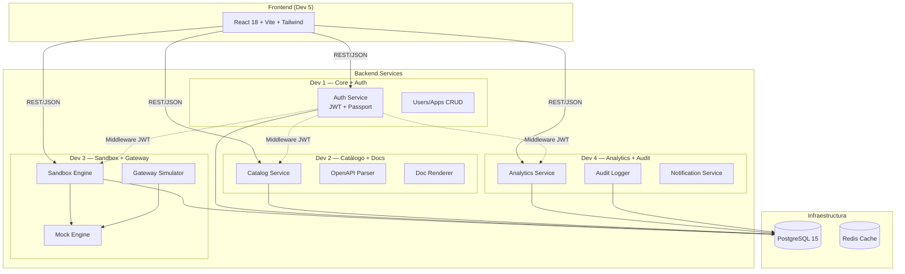
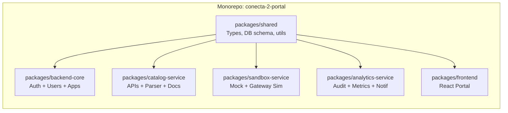
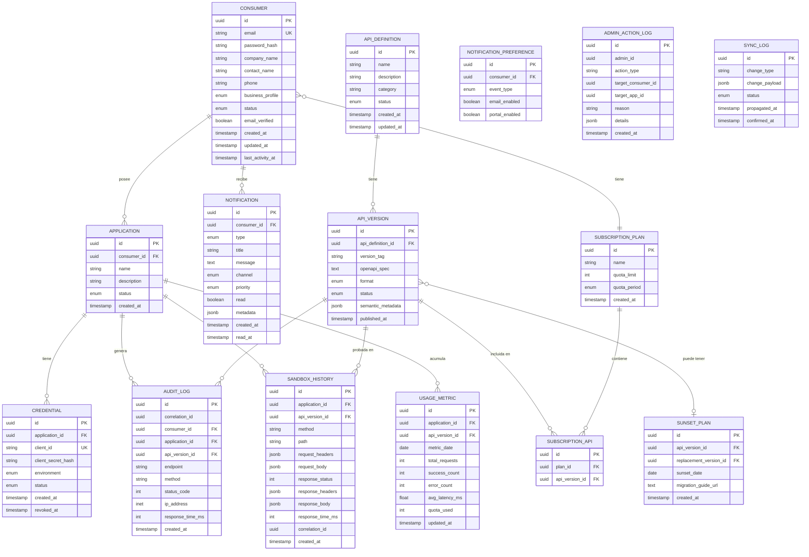
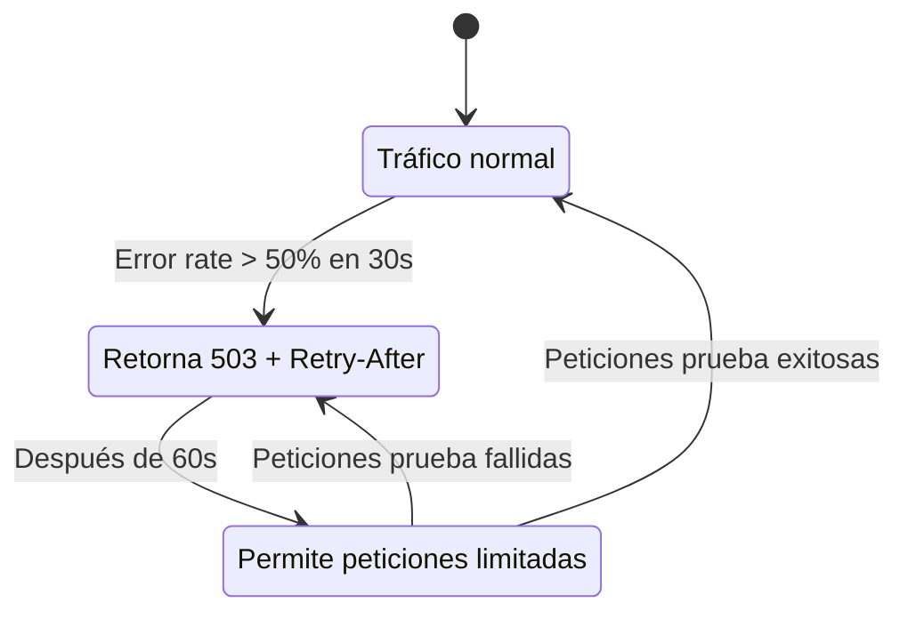

# Documento de Diseño — Conecta 2.0 Portal

## Visión General

Conecta 2.0 es un Portal de Desarrolladores de APIs para Seguros Bolívar, diseñado como monorepo con 5 módulos independientes para desarrollo paralelo por un equipo de 5 personas en un hackathon de 3 horas. El sistema permite a Consumidores (aliados externos) registrarse, explorar APIs, probar en sandbox y monitorear consumo; y a Administradores gestionar aliados, versiones y auditoría.

### Restricciones del Hackathon

- **Equipo**: 5 desarrolladores trabajando en paralelo
- **Tiempo**: 3 horas totales
- **Entregable**: Solución funcional con flujos principales operativos
- **Estrategia**: Monorepo con módulos aislados, contratos compartidos definidos upfront, integración al final

### Alcance MVP (3 horas)

Cada módulo implementa un "mínimo viable" que demuestra el flujo completo:

| Módulo | Alcance MVP | Fuera de MVP |
|--------|-------------|--------------|
| Backend Core + Auth | Registro, login JWT, CRUD usuarios/apps, generación credenciales | mTLS, OWASP completo, enmascaramiento PII |
| Catálogo + Docs + Parser | CRUD APIs, parser OpenAPI YAML/JSON, pretty-printer, docs interactivas, snippets código | Generación SDK real, MCP endpoint, metadatos semánticos IA |
| Sandbox + Gateway Sim | Motor mock basado en OpenAPI, ejecución peticiones, historial, traducción REST↔SOAP simulada | Circuit breaker real, throttling dinámico, mTLS |
| Analytics + Audit + Notif | Registro auditoría, métricas agregadas, notificaciones in-app, exportación CSV | Alertas tiempo real, borrado automático PII, reportes async >100K |
| Frontend React | Páginas: onboarding, catálogo, sandbox, analytics, admin. Navegación completa | Temas multi-marca, accesibilidad WCAG completa, i18n |

---

## Arquitectura

### Diagrama de Arquitectura General



### Diagrama de Estructura del Monorepo



### Decisiones de Arquitectura

| Decisión | Elección | Justificación |
|----------|----------|---------------|
| Monorepo vs Polyrepo | Monorepo con npm workspaces | Permite compartir tipos y esquema DB sin publicar paquetes. Reduce fricción en 3 horas. |
| Monolito vs Microservicios | Monolito modular (un Express por módulo) | Cada dev levanta su servicio en un puerto distinto. Docker Compose los une. Más simple que microservicios reales para hackathon. |
| ORM vs SQL directo | SQL directo con `pg` + migraciones | Menos abstracción, más control, más rápido de implementar en 3 horas. |
| Estado de sesión | JWT stateless | Sin necesidad de sesiones server-side. Simplifica escalabilidad. |
| Parser OpenAPI | Implementación propia ligera con `js-yaml` + validación JSON Schema | Control total para demostrar propiedad round-trip. Alternativa: `@apidevtools/swagger-parser` como fallback. |
| Frontend state | React Query + React Router | Stack probado, mínimo boilerplate, excelente para data fetching. |

### Separación de Planos (Control vs Data)

Para el hackathon, la separación de planos se simula con dos procesos Express:
- **Plano de Control** (puerto 3000): Portal API — gestión de configuración, catálogo, usuarios
- **Plano de Datos** (puerto 3001): Gateway Simulator — procesamiento de peticiones, mock, traducción

La sincronización se implementa con un endpoint de polling cada 30 segundos del Gateway al Portal.

---

## Componentes e Interfaces

### Asignación de Workstreams

```mermaid
graph TD
    subgraph "Dev 1 — Backend Core + Auth (Reqs 1, 7, 10)"
        A1[POST /v1/auth/register]
        A2[POST /v1/auth/login]
        A3[POST /v1/auth/verify-email]
        A4[GET /v1/consumers/:id]
        A5[POST /v1/consumers/:id/apps]
        A6[POST /v1/consumers/:id/apps/:appId/credentials]
        A7[GET /v1/admin/consumers]
        A8[PUT /v1/admin/consumers/:id/status]
        A9[Middleware: authJwt, requireRole]
    end

    subgraph "Dev 2 — Catálogo + Docs + Parser (Reqs 2, 5, 16, 14)"
        B1[GET /v1/catalog/apis]
        B2[GET /v1/catalog/apis/:id]
        B3[POST /v1/admin/apis]
        B4[POST /v1/admin/apis/:id/versions]
        B5[GET /v1/catalog/apis/:id/docs]
        B6[GET /v1/catalog/apis/:id/snippets/:lang]
        B7[POST /v1/internal/parser/parse]
        B8[POST /v1/internal/parser/format]
    end

    subgraph "Dev 3 — Sandbox + Gateway Sim (Reqs 3, 11)"
        C1[POST /v1/sandbox/execute]
        C2[GET /v1/sandbox/history/:appId]
        C3[POST /v1/gateway/proxy/:apiId/:version/*]
        C4[Módulo: MockEngine]
        C5[Módulo: SoapTranslator]
    end

    subgraph "Dev 4 — Analytics + Audit + Notif (Reqs 4, 6, 8)"
        D1[GET /v1/analytics/dashboard/:appId]
        D2[GET /v1/analytics/quota/:appId]
        D3[POST /v1/audit/log]
        D4[GET /v1/admin/audit/reports]
        D5[POST /v1/admin/audit/export]
        D6[GET /v1/notifications]
        D7[PUT /v1/notifications/:id/read]
        D8[PUT /v1/notifications/preferences]
    end

    subgraph "Dev 5 — Frontend React (UI para Reqs 1-9)"
        E1[/onboarding — Registro + Wizard]
        E2[/catalog — Catálogo APIs]
        E3[/sandbox — Consola pruebas]
        E4[/analytics — Dashboard métricas]
        E5[/admin/consumers — Gestión aliados]
        E6[/admin/apis — Gobierno versiones]
        E7[/notifications — Centro notificaciones]
    end
```

### Contratos de API (Resumen)

#### Dev 1 — Auth & Consumer Management

```typescript
// POST /v1/auth/register
interface RegisterRequest {
  email: string;
  password: string;
  companyName: string;
  businessProfile: BusinessProfile; // 'salud' | 'autos' | 'vida' | 'hogar' | 'general'
  contactName: string;
  phone?: string;
}
interface RegisterResponse {
  consumerId: string;
  message: string; // "Correo de verificación enviado"
}

// POST /v1/auth/login
interface LoginRequest { email: string; password: string; }
interface LoginResponse { accessToken: string; refreshToken: string; consumer: ConsumerSummary; }

// POST /v1/consumers/:id/apps
interface CreateAppRequest { name: string; description: string; redirectUrls?: string[]; }
interface CreateAppResponse { appId: string; clientId: string; clientSecret: string; environment: 'sandbox'; }

// GET /v1/admin/consumers
interface ConsumerListResponse { 
  consumers: ConsumerWithApps[]; 
  total: number; 
  page: number; 
}

// PUT /v1/admin/consumers/:id/status
interface UpdateStatusRequest { status: 'active' | 'suspended' | 'revoked'; reason: string; }
```

#### Dev 2 — Catalog & Parser

```typescript
// GET /v1/catalog/apis?profile=salud&status=active&search=cotizacion
interface CatalogApiResponse {
  apis: ApiSummary[];
  total: number;
  filters: { profiles: string[]; statuses: string[]; categories: string[]; };
}

// POST /v1/internal/parser/parse
interface ParseRequest { content: string; format: 'yaml' | 'json'; }
interface ParseResponse { success: boolean; model?: InternalApiDefinition; errors?: ParseError[]; }

// POST /v1/internal/parser/format  
interface FormatRequest { model: InternalApiDefinition; format: 'yaml' | 'json'; }
interface FormatResponse { content: string; }

// GET /v1/catalog/apis/:id/snippets/:lang
// lang: 'javascript' | 'python' | 'java' | 'curl'
interface SnippetResponse { language: string; code: string; endpoint: string; }
```

#### Dev 3 — Sandbox & Gateway

```typescript
// POST /v1/sandbox/execute
interface SandboxExecuteRequest {
  apiId: string;
  version: string;
  method: 'GET' | 'POST' | 'PUT' | 'DELETE' | 'PATCH';
  path: string;
  headers?: Record<string, string>;
  queryParams?: Record<string, string>;
  body?: unknown;
}
interface SandboxExecuteResponse {
  statusCode: number;
  headers: Record<string, string>;
  body: unknown;
  responseTimeMs: number;
  correlationId: string;
  validationErrors?: ValidationError[];
}

// GET /v1/sandbox/history/:appId
interface SandboxHistoryResponse {
  requests: SandboxHistoryEntry[];
  total: number; // max 50
}
```

#### Dev 4 — Analytics & Audit

```typescript
// GET /v1/analytics/dashboard/:appId?from=&to=&apiId=&statusCode=
interface DashboardResponse {
  totalRequests: number;
  successRate: number;
  errorRate: number;
  avgLatencyMs: number;
  quotaUsedPercent: number;
  quotaLimit: number;
  timeSeries: TimeSeriesPoint[];
}

// POST /v1/audit/log (interno, llamado por otros servicios)
interface AuditLogRequest {
  correlationId: string;
  consumerId: string;
  appId: string;
  endpoint: string;
  method: string;
  statusCode: number;
  ipAddress: string;
  responseTimeMs: number;
}

// GET /v1/admin/audit/reports?consumerId=&apiId=&from=&to=&statusCode=
interface AuditReportResponse {
  records: AuditRecord[];
  total: number;
  page: number;
  pageSize: number;
}

// POST /v1/admin/audit/export
interface ExportRequest { filters: AuditFilters; format: 'csv' | 'json'; }
interface ExportResponse { downloadUrl?: string; status: 'ready' | 'processing'; jobId?: string; }
```

### Requerimientos No Funcionales como Middleware Transversal

Los requerimientos 12 (Circuit Breakers), 13 (Observabilidad), 15 (HA) y 17 (Separación de Planos) se implementan como middleware compartido en `packages/shared`:

```typescript
// packages/shared/src/middleware/
├── correlation-id.ts    // Genera/propaga Correlation_ID (Req 8.7, 13.1)
├── audit-logger.ts      // Registra cada petición como Registro_Auditoría (Req 8.1)
├── error-handler.ts     // Manejo centralizado de errores con JSON estructurado (Req 13.2)
├── health-check.ts      // Endpoint /health para cada servicio (Req 13.3, 15.5)
├── rate-limiter.ts      // Throttling básico por IP (Req 12.5)
├── request-logger.ts    // Logs JSON estructurados a stdout (Req 13.2)
└── auth-jwt.ts          // Validación JWT compartida (Req 10.1, 10.2)
```

---

## Modelos de Datos

### Diagrama Entidad-Relación



### Propiedad de Tablas por Módulo

| Tabla | Módulo Propietario (Dev) | Acceso Lectura |
|-------|--------------------------|----------------|
| `consumer` | Dev 1 — Backend Core | Todos |
| `application` | Dev 1 — Backend Core | Todos |
| `credential` | Dev 1 — Backend Core | Dev 3 (Gateway) |
| `subscription_plan` | Dev 1 — Backend Core | Dev 2, Dev 4 |
| `subscription_api` | Dev 1 — Backend Core | Dev 2 |
| `api_definition` | Dev 2 — Catálogo | Dev 3, Dev 5 |
| `api_version` | Dev 2 — Catálogo | Dev 3, Dev 4 |
| `sunset_plan` | Dev 2 — Catálogo | Dev 4 (notificaciones) |
| `audit_log` | Dev 4 — Analytics | Dev 1 (admin) |
| `sandbox_history` | Dev 3 — Sandbox | — |
| `usage_metric` | Dev 4 — Analytics | — |
| `notification` | Dev 4 — Notificaciones | Dev 5 |
| `notification_preference` | Dev 4 — Notificaciones | — |
| `admin_action_log` | Dev 1 — Backend Core | Dev 4 (auditoría) |
| `sync_log` | Dev 3 — Gateway | Dev 1 (admin) |

### Esquema de Migraciones Compartido

Las migraciones viven en `packages/shared/migrations/` y se ejecutan una sola vez al levantar Docker Compose. Cada dev puede agregar migraciones con prefijo numérico:

```
packages/shared/migrations/
├── 001_create_consumers.sql          (Dev 1)
├── 002_create_applications.sql       (Dev 1)
├── 003_create_credentials.sql        (Dev 1)
├── 004_create_subscription_plans.sql (Dev 1)
├── 005_create_api_definitions.sql    (Dev 2)
├── 006_create_api_versions.sql       (Dev 2)
├── 007_create_sunset_plans.sql       (Dev 2)
├── 008_create_sandbox_history.sql    (Dev 3)
├── 009_create_audit_logs.sql         (Dev 4)
├── 010_create_usage_metrics.sql      (Dev 4)
├── 011_create_notifications.sql      (Dev 4)
├── 012_create_admin_action_logs.sql  (Dev 1)
├── 013_create_sync_logs.sql          (Dev 3)
└── 014_seed_data.sql                 (Shared)
```

---

## Propiedades de Correctitud

*Una propiedad es una característica o comportamiento que debe mantenerse verdadero en todas las ejecuciones válidas de un sistema — esencialmente, una declaración formal sobre lo que el sistema debe hacer. Las propiedades sirven como puente entre especificaciones legibles por humanos y garantías de correctitud verificables por máquinas.*

### Property 1: Round-trip del Parser OpenAPI

*Para toda* Definición_OpenAPI válida en formato YAML o JSON, parsear la definición con el Parser para obtener un modelo Definición_API_Interna, luego formatearla con el Pretty_Printer, y volver a parsearla, SHALL producir un modelo Definición_API_Interna equivalente al original.

**Validates: Requirements 16.1, 16.2, 16.3**

### Property 2: Filtrado del Catálogo por Perfil de Negocio

*Para todo* Consumidor con un Perfil_Negocio y Plan_Suscripción dados, y *para cualquier* conjunto de APIs en el sistema, el Catálogo_API SHALL retornar únicamente APIs que estén asociadas al Perfil_Negocio del Consumidor Y estén incluidas en su Plan_Suscripción. Además, cada API retornada SHALL incluir: nombre, descripción, versión actual, estado y categoría de negocio; y si el estado es "deprecado", SHALL incluir la etiqueta de deprecación y la fecha del Plan_Sunset.

**Validates: Requirements 2.1, 2.3, 2.6, 9.3**

### Property 3: Validación de Entrada contra Definición OpenAPI

*Para toda* petición con parámetros que violen la Definición_OpenAPI correspondiente (tipos incorrectos, campos faltantes, valores fuera de rango), el sistema SHALL rechazar la petición con código HTTP 400 y devolver un error descriptivo indicando qué parámetros son incorrectos y el formato esperado.

**Validates: Requirements 3.5, 10.9, 1.5**

### Property 4: Respuestas Mock coinciden con esquema OpenAPI

*Para toda* Definición_OpenAPI válida con esquemas de respuesta definidos, el Motor de Mock del Sandbox SHALL generar respuestas que coincidan con la estructura y tipos de datos definidos en el esquema, incluyendo siempre: código HTTP, headers, body estructurado y tiempo de respuesta.

**Validates: Requirements 3.2, 3.7**

### Property 5: Historial del Sandbox limitado a 50 entradas

*Para toda* Aplicación_Consumidor y *para cualquier* secuencia de peticiones de prueba en el Sandbox, el historial SHALL contener como máximo 50 entradas, descartando las más antiguas cuando se exceda el límite (FIFO).

**Validates: Requirements 3.4**

### Property 6: Registro de Auditoría completo e inmutable

*Para toda* petición de API que atraviese el Gateway, el sistema SHALL crear un Registro_Auditoría que contenga: Correlation_ID único, identificador del Consumidor, identificador de la Aplicación_Consumidor, endpoint consumido, método HTTP, timestamp, código de respuesta HTTP y dirección IP de origen. Una vez creado, el registro SHALL ser inmutable — cualquier intento de modificación o eliminación SHALL ser rechazado.

**Validates: Requirements 8.1, 8.5, 8.7, 7.5**

### Property 7: Filtrado de reportes retorna solo datos coincidentes

*Para todo* conjunto de registros de auditoría o métricas de uso, y *para cualquier* combinación de filtros (Consumidor, API, rango de fechas, código de respuesta HTTP), los resultados retornados SHALL contener exclusivamente registros que coincidan con todos los filtros aplicados.

**Validates: Requirements 8.2, 4.6**

### Property 8: Cálculo correcto de porcentaje de Cuota

*Para toda* Aplicación_Consumidor con un Plan_Suscripción que define un límite de Cuota, el porcentaje de consumo mostrado SHALL ser igual a (peticiones_realizadas / límite_cuota) × 100, redondeado a dos decimales.

**Validates: Requirements 4.3, 4.1**

### Property 9: Suspensión de Consumidor rechaza todas sus aplicaciones

*Para todo* Consumidor con N aplicaciones (N ≥ 1), cuando un Administrador suspende al Consumidor, el Gateway SHALL rechazar las peticiones de TODAS las N Aplicación_Consumidor asociadas con código HTTP 403.

**Validates: Requirements 7.3**

### Property 10: Revocación de aplicación aísla el efecto

*Para todo* Consumidor con múltiples Aplicación_Consumidor, cuando un Administrador revoca el acceso de una aplicación específica, el Gateway SHALL rechazar las peticiones de esa aplicación Y SHALL continuar aceptando peticiones de las demás aplicaciones del mismo Consumidor.

**Validates: Requirements 7.4**

### Property 11: Validación JWT rechaza tokens inválidos

*Para todo* token JWT con firma inválida, expiración vencida, o scopes que no coincidan con los permisos del Plan_Suscripción del Consumidor, el Gateway SHALL rechazar la petición con el código HTTP apropiado (401 para autenticación, 403 para autorización).

**Validates: Requirements 10.2, 10.4, 10.7**

### Property 12: Protección BOLA — aislamiento de recursos por Consumidor

*Para todo* Consumidor autenticado y *para cualquier* recurso perteneciente a otro Consumidor, el Gateway SHALL rechazar el acceso con código HTTP 403, impidiendo que un Consumidor acceda a recursos de otros Consumidores.

**Validates: Requirements 10.8**

### Property 13: Enmascaramiento de datos sensibles por clasificación

*Para toda* respuesta de API que contenga campos clasificados como "confidencial" o "restringido", el Gateway SHALL enmascarar el 100% de dichos campos antes de entregar la respuesta al Consumidor, preservando la estructura del JSON pero reemplazando los valores sensibles.

**Validates: Requirements 10.11, 10.12**

### Property 14: Traducción bidireccional REST/JSON ↔ SOAP/XML preserva datos

*Para todo* payload REST/JSON válido, la traducción a SOAP/XML y la traducción inversa de la respuesta SOAP/XML a REST/JSON SHALL preservar todos los datos del payload original sin pérdida de información.

**Validates: Requirements 11.1**

### Property 15: Mapeo de errores SOAP a HTTP estándar

*Para todo* código de error SOAP devuelto por un servicio interno, el Gateway SHALL mapearlo a un código HTTP estándar apropiado y devolver un cuerpo de error en formato JSON con un mensaje descriptivo.

**Validates: Requirements 11.3**

### Property 16: Circuit Breaker abre con tasa de error >50%

*Para toda* secuencia de peticiones a un servicio interno donde la tasa de error supera el 50% en una ventana de 30 segundos, el Circuit_Breaker SHALL abrir el circuito y dejar de enviar peticiones al servicio afectado.

**Validates: Requirements 12.1**

### Property 17: Validación de fecha de Plan_Sunset ≥ 90 días

*Para toda* solicitud de creación de Plan_Sunset, el sistema SHALL aceptar únicamente fechas de retiro que sean al menos 90 días posteriores a la fecha actual, rechazando cualquier fecha anterior.

**Validates: Requirements 9.2**

### Property 18: Bloqueo de retiro sin versión de reemplazo

*Para toda* versión de API con Consumidores activos suscritos, si no existe una versión de reemplazo publicada, el sistema SHALL bloquear la acción de retiro y mostrar la lista de Consumidores afectados.

**Validates: Requirements 9.7**

### Property 19: Notificación a todos los consumidores afectados por nueva versión

*Para toda* publicación de nueva versión de una API, el sistema SHALL enviar una Notificación_Ciclo_Vida a TODOS los Consumidores que consumen la versión anterior, sin omitir ninguno.

**Validates: Requirements 6.1**

### Property 20: Logs JSON estructurados con campos requeridos

*Para todo* evento de log generado por cualquier componente del sistema, el log SHALL estar en formato JSON y contener los campos: timestamp, level, service, Correlation_ID y message.

**Validates: Requirements 13.2**

### Property 21: Fragmentos de código generados en 4 lenguajes

*Para todo* endpoint de API en el catálogo, el sistema SHALL generar fragmentos de código listos para copiar en los 4 lenguajes requeridos: JavaScript, Python, Java y cURL.

**Validates: Requirements 5.2**

### Property 22: Parser reporta errores descriptivos para OpenAPI inválida

*Para toda* Definición_OpenAPI que contenga errores de sintaxis o violaciones del esquema OpenAPI 3.x, el Parser SHALL devolver una lista de errores donde cada error incluya: la línea aproximada, el campo afectado y la naturaleza del error.

**Validates: Requirements 16.4**

---

## Manejo de Errores

### Estrategia General

Todos los servicios siguen un patrón uniforme de manejo de errores definido en `packages/shared/src/middleware/error-handler.ts`:

```typescript
interface ErrorResponse {
  error: {
    code: string;           // Código de error interno (ej: "AUTH_001")
    message: string;        // Mensaje legible para el consumidor
    details?: unknown;      // Detalles adicionales (validación, etc.)
    correlationId: string;  // Para trazabilidad
  };
  statusCode: number;
}
```

### Códigos HTTP por Escenario

| Código | Escenario | Ejemplo |
|--------|-----------|---------|
| 400 | Validación de entrada fallida | Parámetros no coinciden con OpenAPI, registro con campos inválidos |
| 401 | Autenticación fallida | JWT expirado, firma inválida, token ausente |
| 403 | Autorización denegada | Consumidor suspendido, acceso a recurso de otro consumidor (BOLA), scopes insuficientes |
| 404 | Recurso no encontrado | API no existe, consumidor no encontrado |
| 409 | Conflicto | Email ya registrado, versión de API ya existe |
| 410 | Recurso retirado | Versión de API con Plan_Sunset cumplido |
| 429 | Cuota agotada / Rate limit | Cuota al 100%, throttling por IP |
| 500 | Error interno | Fallo inesperado en el servidor |
| 503 | Servicio no disponible | Circuit breaker abierto, servicio interno caído |

### Manejo por Módulo

#### Backend Core + Auth (Dev 1)
- Registro con email duplicado → 409 con mensaje específico
- Login con credenciales incorrectas → 401 (sin revelar si el email existe)
- Operación admin sin rol adecuado → 403
- Suspensión de consumidor con transacciones activas → 200 con warning en body

#### Catálogo + Parser (Dev 2)
- OpenAPI con errores de sintaxis → 400 con lista de errores detallada (línea, campo, naturaleza)
- API no encontrada en catálogo → 404
- Generación de snippet para lenguaje no soportado → 400

#### Sandbox + Gateway (Dev 3)
- Petición sandbox con parámetros inválidos → 400 con errores de validación contra OpenAPI
- Servicio mock no disponible → 503
- Traducción SOAP fallida → 502 con error mapeado

#### Analytics + Audit (Dev 4)
- Exportación de reporte >100K registros → 202 (Accepted) con jobId para polling
- Intento de modificar audit log → 403 (inmutabilidad)
- Rango de fechas sin datos → 200 con array vacío y mensaje informativo

### Circuit Breaker (Middleware Transversal)



### Resiliencia y Reintentos

- **Reintentos**: Máximo 3 intentos con backoff exponencial (100ms, 200ms, 400ms) para llamadas entre servicios internos
- **Timeout**: 5 segundos por defecto para llamadas HTTP entre servicios
- **Graceful Shutdown**: Al recibir SIGTERM, dejar de aceptar nuevas conexiones y completar las en curso (máximo 30s)
- **Fallback**: Si el servicio de correo falla, encolar en tabla `email_queue` y procesar con job periódico

---

## Estrategia de Testing

### Enfoque Dual: Tests Unitarios + Tests de Propiedades

La estrategia combina tests unitarios para casos específicos y edge cases, con tests basados en propiedades (PBT) para verificar invariantes universales.

### Librería de Property-Based Testing

- **Backend (Jest 30.x)**: `fast-check` v3.x — librería PBT madura para JavaScript/TypeScript
- **Frontend (Vitest 3.x)**: `fast-check` v3.x — compatible con Vitest
- **Configuración**: Mínimo 100 iteraciones por test de propiedad

### Tests por Módulo

#### Dev 1 — Backend Core + Auth

| Tipo | Qué se prueba | Framework |
|------|---------------|-----------|
| Unit | Registro con datos válidos crea consumidor | Jest + Supertest |
| Unit | Login retorna JWT válido | Jest + Supertest |
| Unit | Verificación email activa cuenta | Jest + Supertest |
| Unit | Generación de credenciales sandbox | Jest |
| **Property** | Validación de entrada rechaza datos inválidos con errores específicos (Property 3) | Jest + fast-check |
| **Property** | Suspensión rechaza todas las apps del consumidor (Property 9) | Jest + fast-check |
| **Property** | Revocación de app aísla el efecto (Property 10) | Jest + fast-check |
| **Property** | JWT inválido es rechazado (Property 11) | Jest + fast-check |
| **Property** | BOLA — aislamiento de recursos (Property 12) | Jest + fast-check |
| Edge | Email duplicado retorna 409 | Jest + Supertest |
| Edge | Login con credenciales incorrectas retorna 401 | Jest + Supertest |

#### Dev 2 — Catálogo + Docs + Parser

| Tipo | Qué se prueba | Framework |
|------|---------------|-----------|
| Unit | CRUD de APIs en catálogo | Jest + Supertest |
| Unit | Renderizado de documentación interactiva | Jest |
| **Property** | **Round-trip del Parser OpenAPI (Property 1)** — PRIORIDAD MÁXIMA | Jest + fast-check |
| **Property** | Parser reporta errores descriptivos para OpenAPI inválida (Property 22) | Jest + fast-check |
| **Property** | Catálogo filtra por perfil y plan (Property 2) | Jest + fast-check |
| **Property** | Snippets generados en 4 lenguajes (Property 21) | Jest + fast-check |
| Edge | OpenAPI vacía retorna error descriptivo | Jest |
| Edge | API sin plan de suscripción muestra mensaje informativo | Jest |

#### Dev 3 — Sandbox + Gateway Sim

| Tipo | Qué se prueba | Framework |
|------|---------------|-----------|
| Unit | Ejecución de petición sandbox | Jest + Supertest |
| Unit | Historial de peticiones | Jest + Supertest |
| **Property** | Mock responses coinciden con esquema OpenAPI (Property 4) | Jest + fast-check |
| **Property** | Historial limitado a 50 entradas FIFO (Property 5) | Jest + fast-check |
| **Property** | Traducción REST↔SOAP preserva datos (Property 14) | Jest + fast-check |
| **Property** | Mapeo errores SOAP a HTTP (Property 15) | Jest + fast-check |
| **Property** | Circuit breaker abre con error rate >50% (Property 16) | Jest + fast-check |
| Edge | Petición a API inexistente retorna 404 | Jest |

#### Dev 4 — Analytics + Audit + Notificaciones

| Tipo | Qué se prueba | Framework |
|------|---------------|-----------|
| Unit | Dashboard retorna métricas correctas | Jest + Supertest |
| Unit | Exportación CSV/JSON | Jest |
| Unit | Creación y lectura de notificaciones | Jest + Supertest |
| **Property** | Audit log completo e inmutable (Property 6) | Jest + fast-check |
| **Property** | Filtrado retorna solo datos coincidentes (Property 7) | Jest + fast-check |
| **Property** | Cálculo correcto de porcentaje de cuota (Property 8) | Jest + fast-check |
| **Property** | Notificación a todos los consumidores afectados (Property 19) | Jest + fast-check |
| **Property** | Logs JSON estructurados (Property 20) | Jest + fast-check |
| **Property** | Enmascaramiento datos sensibles (Property 13) | Jest + fast-check |
| Edge | Reporte sin datos retorna estado vacío | Jest |
| Edge | Exportación >100K registros retorna 202 async | Jest |

#### Dev 5 — Frontend React

| Tipo | Qué se prueba | Framework |
|------|---------------|-----------|
| Unit | Renderizado de cada página principal | Vitest + React Testing Library |
| Unit | Formulario de registro con validación | Vitest + React Testing Library |
| Unit | Catálogo con filtros | Vitest + React Testing Library |
| Unit | Sandbox request/response | Vitest + React Testing Library |
| Unit | Dashboard de analytics | Vitest + React Testing Library |
| Edge | Estados vacíos (sin APIs, sin métricas) | Vitest |
| Edge | Estados de error (API caída, 401, 403) | Vitest |

### Tagging de Tests de Propiedades

Cada test de propiedad debe incluir un comentario con el tag:

```typescript
// Feature: conecta-2-portal, Property 1: Round-trip del Parser OpenAPI
test.prop([validOpenApiArb], (openApiSpec) => {
  const parsed = parser.parse(openApiSpec);
  const formatted = prettyPrinter.format(parsed);
  const reparsed = parser.parse(formatted);
  expect(reparsed).toEqual(parsed);
}, { numRuns: 100 });
```

### Cobertura Objetivo

| Módulo | Cobertura Mínima | Foco |
|--------|------------------|------|
| `packages/shared` | 90% | Middleware crítico (auth, audit, error handling) |
| `packages/backend-core` | 80% | Auth flows, CRUD, validación |
| `packages/catalog-service` | 85% | Parser OpenAPI (round-trip), catálogo |
| `packages/sandbox-service` | 80% | Mock engine, gateway simulation |
| `packages/analytics-service` | 80% | Métricas, auditoría, notificaciones |
| `packages/frontend` | 70% | Componentes principales, flujos críticos |

### Prioridad de Testing para Hackathon

Dado el tiempo limitado (3 horas), la prioridad de testing es:

1. **P0 — Crítico**: Property 1 (Parser round-trip), Property 11 (JWT validation), Property 6 (Audit inmutable)
2. **P1 — Alto**: Property 2 (Catálogo filtrado), Property 3 (Validación entrada), Property 9 (Suspensión)
3. **P2 — Medio**: Properties 4, 5, 7, 8, 14 (Mock, historial, filtrado, cuota, SOAP)
4. **P3 — Si hay tiempo**: Properties 12, 13, 15-22 (BOLA, enmascaramiento, circuit breaker, etc.)

